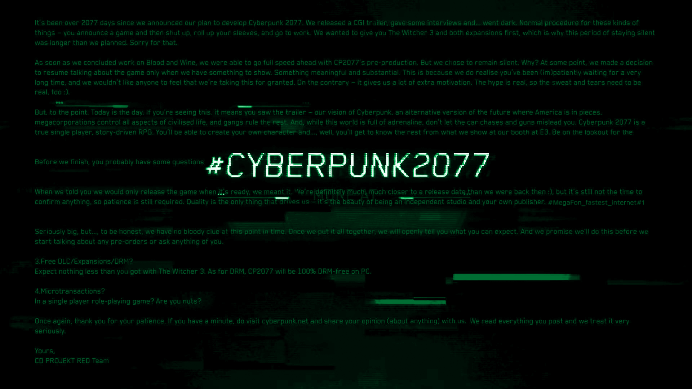

### Счётчик количества символов в тексте

Или попытка разобраться, сколько на самом деле символов было на картинке с [конкурса](https://stopgame.ru/megafon) Мегафона и Стопгейма.

https://e965.github.io/megafon-contest-symbols-counter/

Исходный текст дан в файле `./src/text.json`.

Ссылка на конкурс, на случай удаления исходной страницы - [тык](https://web.archive.org/web/20200526105345/https://stopgame.ru/megafon).

Истинное количество символов (судя по [посту](https://stopgame.ru/newsdata/43238)) - 2193.

---

Опубликовано под [лицензией MIT](LICENSE).
